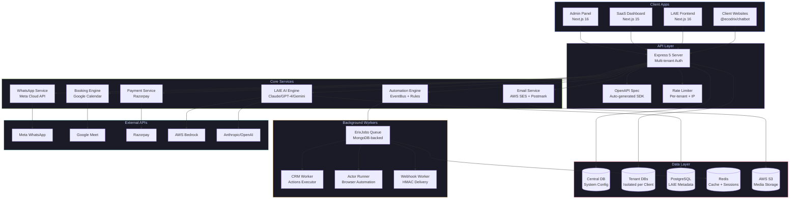
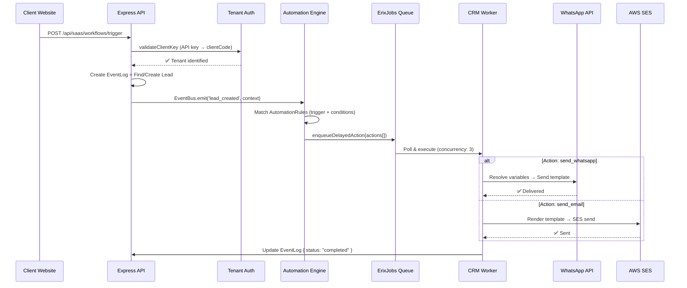
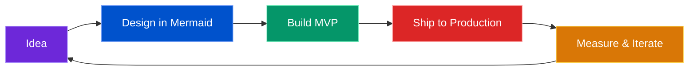
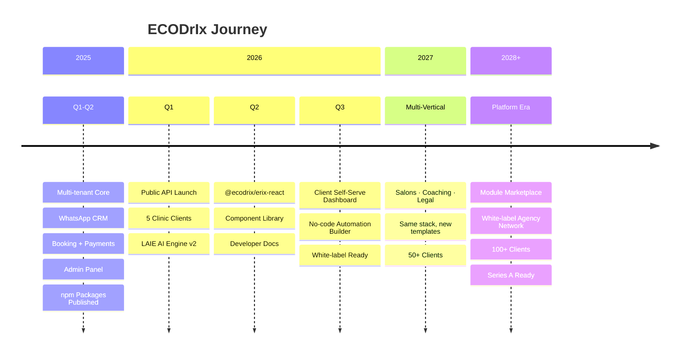

<!-- Banner -->


<div align="center">


<br/>

[](https://portfolio.ecodrix.com/)
[](https://www.linkedin.com/in/dhanesh-mekalthuru-5baa9323b/)
[](https://www.npmjs.com/~ecodrix)
[](https://www.buymeacoffee.com/dhanesh1232)

<br/>


&nbsp;

&nbsp;


</div>

---

## 👋 Who I Am

Self-taught full-stack engineer from India 🇮🇳 building production SaaS systems solo.

I design **multi-tenant architectures**, ship **published npm packages**, build **AI-powered automation engines**, and deploy to production every day. My work spans from low-level job queue systems to polished React component libraries.

**Not just coding — building a business.** ECODrIx is a real product serving real clients, handling real WhatsApp messages, processing real payments.

<details>
<summary>💬 <b>Ask me about</b></summary>
<br/>

- Multi-tenant SaaS architecture (dual-database strategy, tenant isolation)
- WhatsApp Cloud API integration (webhooks, templates, bulk messaging)
- Building custom job queue systems without Redis
- AI-powered lead generation and scoring pipelines
- Publishing and maintaining npm packages (SDK generation from OpenAPI)
- Event-driven automation engines with variable resolution
- Browser automation at scale (Playwright, proxy rotation, session isolation)
- Scaling a solo SaaS from 0 → paying clients

</details>

---

## 🔥 Currently Shipping

```diff
+ 🚀 LAIE v2 — AI lead scoring with multi-model fallback (Claude → GPT-4 → Gemini)
+ 📦 @ecodrix/erix-react v0.2.3 — CRM + Analytics + WhatsApp React components
+ 🌐 Public API docs — OpenAPI 3.1 spec with auto-generated SDK
+ 🧪 Browser automation actors — Playwright + proxy rotation + session isolation
! 🎯 Next: Client self-serve dashboard with no-code automation builder
```

---

## 🏗️ Flagship: ECODrIx Platform

> **Multi-tenant business automation platform** — WhatsApp CRM, AI lead generation, booking, payments, and email marketing through a single API.


<!-- 
  📸 DEMO GIF PLACEHOLDER
  To add: Record a 15-second screen capture of your admin panel or WhatsApp CRM,
  convert to GIF using https://gifcap.dev or CloudConvert,
  upload to your repo, and uncomment the line below:
-->
<!-- <div align="center"></div> -->

### 🧬 System Architecture



### ⚡ Automation Flow — How a Trigger Becomes an Action



<table>
<tr>
<td width="50%">

### Architecture Highlights
- **Dual-database multi-tenancy** — Central DB for system config + isolated tenant DBs per client
- **Custom job queue** (ErixJobs) — MongoDB-backed, no Redis dependency, retry with exponential backoff
- **Event-driven automation** — Trigger → Rule Match → Context Resolution → Action Execution
- **Real-time layer** — Socket.IO for live WhatsApp inbox updates
- **API-first** — OpenAPI spec, auto-generated SDK, per-tenant rate limiting
- **Idempotency middleware** — Prevents duplicate webhook processing

</td>
<td width="50%">

### System Scale
- **10+ microservices** across 4 frontend apps + 1 monolithic backend
- **Published npm packages** — `@ecodrix/erix-api`, `@ecodrix/erix-react`, `@ecodrix/chatbot`
- **10k+ contacts** per bulk WhatsApp campaign via queue processing
- **Tenant isolation** at every layer — DB, API, auth, CORS, rate limits
- **5 AI models** — Claude, GPT-4, Gemini, Vertex AI, AWS Bedrock
- **Webhook HMAC signing** — All outbound callbacks cryptographically verified

</td>
</tr>
</table>

---

### 📦 Live Modules

| Module | What It Does | Key Tech |
|--------|-------------|----------|
| 🔵 **Multi-Tenant Core** | Tenant-scoped APIs, dynamic DB connections, custom field registry | MongoDB, Connection Pooling, Zod |
| 📱 **WhatsApp CRM** | Message threading, contact management, template sending via Cloud API | Meta Cloud API, Socket.IO, Webhooks |
| 📨 **Bulk Sender** | Excel upload → E.164 normalize → queue → 10k+ contacts delivered | ErixJobs, Bull Queue, Worker Threads |
| 🤖 **LAIE (AI Engine)** | AI lead qualification, scoring, enrichment, autonomous research | Claude/GPT-4/Gemini, Playwright, Crawlee |
| 📧 **Email Marketing** | Campaign builder, SES integration, domain verification, compliance gates | AWS SES, Postmark, DKIM/SPF |
| 📅 **Booking Engine** | Slot availability, real-time booking, conflict prevention, Meet auto-create | Google Calendar API, Razorpay |
| 💳 **Payments** | Order creation, webhook verification, appointment-payment linking | Razorpay, HMAC Webhooks |
| 🎯 **Automation Engine** | Event-driven rules, sequences, variable resolution, delayed actions | EventBus, Handlebars, Cron |
| 📊 **Analytics** | Business metrics, campaign performance, funnel tracking | Recharts, Aggregation Pipelines |
| 🌐 **Browser Automation** | Headless scraping, proxy rotation, session isolation, actor runtime | Playwright, Puppeteer, Crawlee |
| 🔐 **Security Layer** | Plan guards, quota enforcement, storage limits, CORS allowlists | JWT, HMAC, Rate Limiting |


---

### 💡 Code Showcase

<details>
<summary><b>🔌 Tenant Connection Manager — How multi-tenancy works at the DB level</b></summary>

```typescript
// Every tenant gets their own isolated MongoDB connection
// Connections are pooled and cached — no cold starts after first request

const connectionCache = new Map<string, mongoose.Connection>();

export async function getTenantConnection(clientCode: string): Promise<mongoose.Connection> {
  if (connectionCache.has(clientCode)) {
    return connectionCache.get(clientCode)!;
  }

  const dataSource = await ClientDataSource.findOne({ clientCode });
  if (!dataSource) throw new TenantNotFoundError(clientCode);

  const conn = await mongoose.createConnection(dataSource.mongoUri, {
    maxPoolSize: 10,
    serverSelectionTimeoutMS: 5000,
  }).asPromise();

  connectionCache.set(clientCode, conn);
  return conn;
}

// Usage — tenant data never leaks across clients
const { Lead, Pipeline, AutomationRule } = await getCrmModels(clientCode);
const leads = await Lead.find({ status: "qualified" }); // Always scoped to tenant
```

</details>

<details>
<summary><b>🤖 Automation Rule Engine — Event-driven action execution</b></summary>

```typescript
// When a trigger fires, the engine matches rules and executes actions

export async function runAutomations(clientCode: string, trigger: string, context: TriggerContext) {
  const { AutomationRule } = await getCrmModels(clientCode);
  
  // Find all active rules matching this trigger
  const rules = await AutomationRule.find({ 
    clientCode, 
    trigger, 
    isActive: true 
  });

  for (const rule of rules) {
    // Evaluate conditions against lead + event context
    if (!evaluateCondition(rule.condition, context)) continue;

    if (rule.isSequence) {
      await enrollInSequence(clientCode, rule, context.lead);
    } else {
      for (const action of rule.actions) {
        await enqueueDelayedAction({
          clientCode,
          action,
          context,
          delay: action.delaySeconds ?? 0,
        });
      }
    }
  }
}
```

</details>

<details>
<summary><b>📨 Variable Resolution — Dynamic template rendering</b></summary>

```typescript
// Resolves {{lead.firstName}}, {{event.productName}}, {{resolved.meetLink}}

export class VariableResolver {
  private layers: Map<string, Record<string, unknown>>;

  constructor(lead: Lead, event: TriggerPayload, derived: DerivedContext) {
    this.layers = new Map([
      ["lead", lead.toObject()],        // {{lead.firstName}}, {{lead.phone}}
      ["event", event.variables ?? {}],  // {{event.productName}}, {{event.amount}}
      ["resolved", derived],             // {{resolved.meetLink}}, {{resolved.today}}
    ]);
  }

  resolve(template: string): string {
    return template.replace(/\{\{(\w+)\.(\w+)\}\}/g, (_, layer, key) => {
      return String(this.layers.get(layer)?.[key] ?? "");
    });
  }
}

// "Hello {{lead.firstName}}, your meeting: {{resolved.meetLink}}"
// → "Hello Ravi, your meeting: https://meet.google.com/abc-def-ghi"
```

</details>

---

### 📚 Published npm Packages

| Package | Version | Downloads | Description |
|---------|---------|-----------|-------------|
| [`@ecodrix/erix-api`](https://www.npmjs.com/package/@ecodrix/erix-api) |  |  | Isomorphic SDK — WhatsApp, CRM, Storage, Meetings. Auto-generated from OpenAPI. |
| [`@ecodrix/erix-react`](https://www.npmjs.com/package/@ecodrix/erix-react) |  |  | Full React component library — Editor, CRM, Analytics, WhatsApp, Dashboard |
| [`@ecodrix/chatbot`](https://www.npmjs.com/package/@ecodrix/chatbot) |  |  | Lightweight embeddable chatbot widget — iframe-based, zero deps |
| [`erix`](https://www.npmjs.com/package/erix) |  |  | Git automation CLI — one-command commit, push, repo management |

**Quick install:**
```bash
# SDK for any JavaScript/TypeScript project
npm install @ecodrix/erix-api

# React components for dashboards
npm install @ecodrix/erix-react

# Git automation CLI (global)
npm install -g erix
```

---

## 🛠️ Tech Stack (What I Actually Use Daily)

<details open width="100%">
<summary><b>Full Stack Breakdown</b></summary>
<br/>

| Layer | Technologies |
|-------|-------------|
| **Frontend** |      |
| **Backend** |      |
| **Databases** |     |
| **AI/ML** |     |
| **Cloud & Infra** | -FF9900?style=flat-square&logo=amazon-aws&logoColor=white)    |
| **DevOps** |     |
| **Automation** |    |
| **APIs** |    |
| **Testing** |    |

</details>

---

## ⚙️ How I Work



| Principle | How |
|-----------|-----|
| **Ship daily** | Every day has a commit. Small PRs, fast feedback loops. |
| **Design before code** | Mermaid diagrams, OpenAPI specs, and architecture docs come first. |
| **Automate everything** | CI/CD, SDK generation, linting, type checking — all automated. |
| **AI as a multiplier** | I use AI for code review, lead scoring, content generation — not as a crutch. |
| **Build in public** | Document decisions, share numbers, admit mistakes. |


---

## 📊 By The Numbers

<div align="center">

| Metric | Count |
|--------|-------|
| 🏗️ **Production Services** | 10+ microservices |
| 📦 **npm Packages Published** | 4 packages (public registry) |
| 🔌 **API Endpoints** | 80+ REST endpoints |
| 🗄️ **Database Models** | 30+ schemas (MongoDB + PostgreSQL) |
| 🤖 **AI Models Integrated** | 5 (Claude, GPT-4, Gemini, Bedrock, Vertex) |
| 📱 **WhatsApp Messages** | 10k+ per bulk campaign |
| 🧪 **Testing** | Vitest + Property-based (fast-check) |
| 🚀 **Deployment** | Daily via GitHub Actions + Render + Vercel |
| 🖥️ **Frontend Apps** | 4 (Admin, SaaS, LAIE, Portfolio) |
| 🔧 **Background Workers** | 4 (CRM, Actor, Webhook, Cron) |

</div>

---

## 🧠 What Sets Me Apart

<table>
<tr>
<td width="33%" valign="top">

### 🏭 Systems Thinking
I don't just write endpoints — I design **tenant-isolated architectures**, build **custom job queues**, implement **event-driven automation engines**, and handle **webhook signature verification** at scale.

</td>
<td width="33%" valign="top">

### 📦 Ship to npm
I publish and maintain **real packages** used in production. Auto-generated SDKs from OpenAPI specs, React component libraries with CSS isolation, embeddable widgets with zero dependencies.

</td>
<td width="33%" valign="top">

### 🤖 AI-Native Development
Every product I build integrates AI — from **lead scoring with Claude** to **autonomous web research agents** using Playwright + LLMs to **multi-model fallback chains**.

</td>
</tr>
</table>

---

## 📈 GitHub Stats

<div align="center">

<a href="https://github.com/dhanesh1232">
  
</a>

</div>

<div align="center">

<a href="https://github.com/dhanesh1232">
  
</a>
<a href="https://github.com/dhanesh1232">
  
</a>

</div>

<div align="center">

<a href="https://github.com/dhanesh1232">
  
</a>
<a href="https://github.com/dhanesh1232">
  
</a>
<a href="https://github.com/dhanesh1232">
  
</a>

</div>

<div align="center">

[](https://github.com/dhanesh1232)

</div>

---

## 🗺️ ECODrIx Roadmap



---

## 🏆 Trophies

<div align="center">


</div>

---

## 🏗️ Other Projects

| Project | Description | Stack |
|---------|-------------|-------|
| **[LAIE](https://github.com/dhanesh1232)** | AI-powered lead generation — qualification, scoring, enrichment, autonomous research agents | Next.js 16, Claude/GPT-4, Playwright, PostgreSQL, Drizzle |
| **[Erix Store](https://github.com/dhanesh1232)** | In-memory real-time data store with WebSocket sync & MessagePack serialization | Express, WebSockets, MessagePack, PostgreSQL |
| **[Erix CLI](https://github.com/dhanesh1232/erix)** | One-command Git automation — commit, push, manage repos with interactive prompts | Node.js, Inquirer, Octokit, Chalk, Zod |
| **[Portfolio](https://portfolio.ecodrix.com)** | Personal portfolio & blog | Next.js, TailwindCSS, Framer Motion |

---

## 🤝 Work With Me

<table>
<tr>
<td>🏥</td>
<td><b>ECODrIx Early Access</b></td>
<td>Indian clinics, salons, coaching businesses wanting WhatsApp + CRM + Payments automation</td>
</tr>
<tr>
<td>🧑‍💼</td>
<td><b>Technical Advisory</b></td>
<td>Founders building on WhatsApp Cloud API, multi-tenant SaaS, Node.js/TypeScript at scale</td>
</tr>
<tr>
<td>🏢</td>
<td><b>White-Label Partnership</b></td>
<td>Web agencies wanting to resell ECODrIx under their own brand</td>
</tr>
<tr>
<td>💻</td>
<td><b>Open Source</b></td>
<td>Contributors to Node.js · TypeScript · MongoDB · WhatsApp API ecosystem</td>
</tr>
<tr>
<td>🎙️</td>
<td><b>Build in Public</b></td>
<td>I document architecture decisions, revenue numbers, mistakes, and wins publicly</td>
</tr>
</table>

---

## 📣 Building in Public

I share the full journey — architecture decisions, scaling challenges, revenue milestones, and honest mistakes.

> *"The best way to learn is to build something real, ship it, and let the market tell you what's wrong."*

<div align="center">

[](https://www.linkedin.com/in/dhanesh-mekalthuru-5baa9323b/)
[](https://www.instagram.com/erix.__.after17_59/)
[](https://portfolio.ecodrix.com/)
[](https://www.buymeacoffee.com/dhanesh1232)

</div>

---

<div align="center">

```
 ┌─────────────────────────────────────────────────────────────┐
 │                                                             │
 │   ECODrIx — Invisible Infrastructure for Indian SMBs        │
 │   Built solo · Shipped daily · Powered by AI leverage       │
 │                                                             │
 │   Dhanesh M · India 🇮🇳 · Building in public since 2025      │
 │                                                             │
 └─────────────────────────────────────────────────────────────┘
```

</div>


